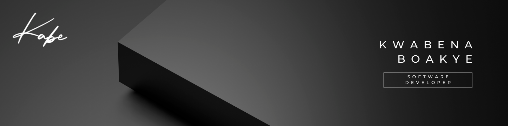

### Hi there 👋, my name is Kwabena Boakye
I'm from Kumasi, Ghana and I'm a Frontend Developer

I really enjoy learning languages and frameworks like Javascript, Typescript, Python, React, and Tailwind CSS. I enjoy wireframing, UI, UX, and design in general

## Skills and Experience
* ⚛️ NEXTJS
* ⚛️ REACT
* 💻HTML, CSS, JS
* TYPESCRIPT
* PYTHON
* PHP

- 🔭 I’m currently working on my portfolio website 
- 🌱 I’m currently learning React with Typescript 

           

 

